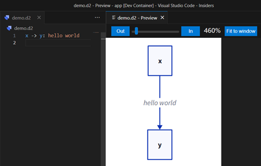

## D2 DevContainer Playground

This is a simple demo of how to use [D2](https://d2lang.com) in a DevContainer.

### Preview

right click on the `demo.d2` file and select `Show D2 Preview`

or 

- run `d2 demo.d2 --watch` in the terminal
- open `VsCode PORTS` tab and click on the `Preview in the Editor` button

